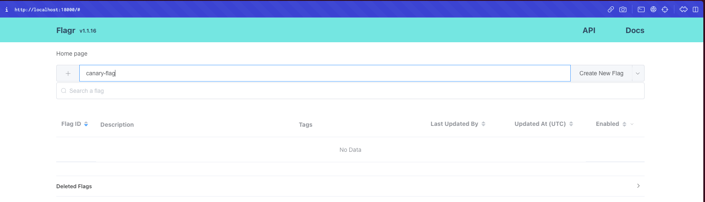
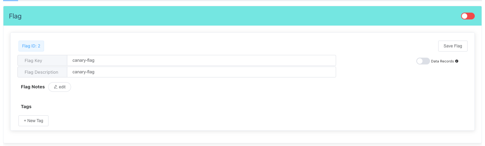
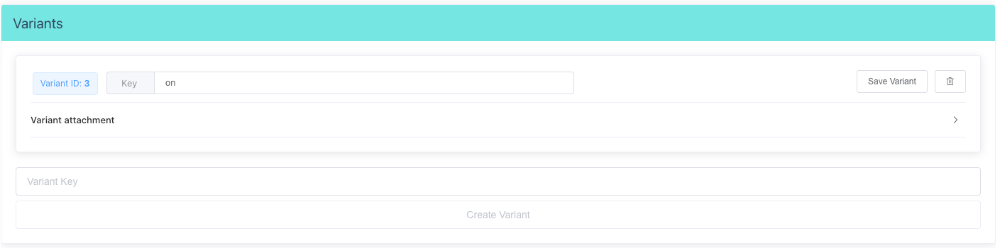
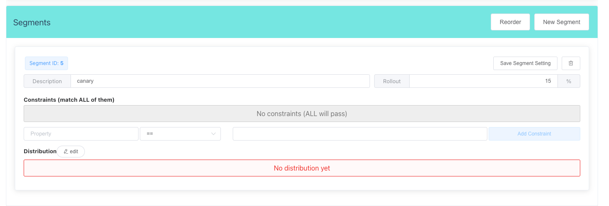
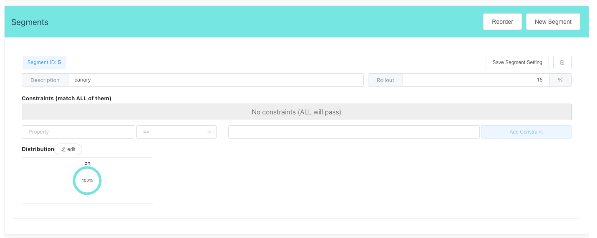
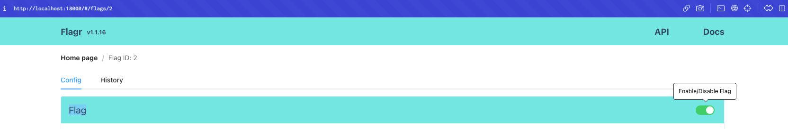
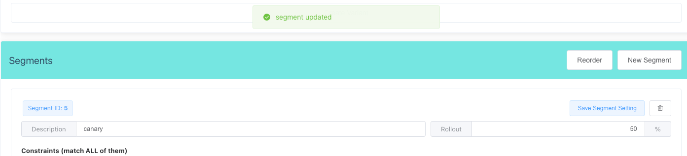
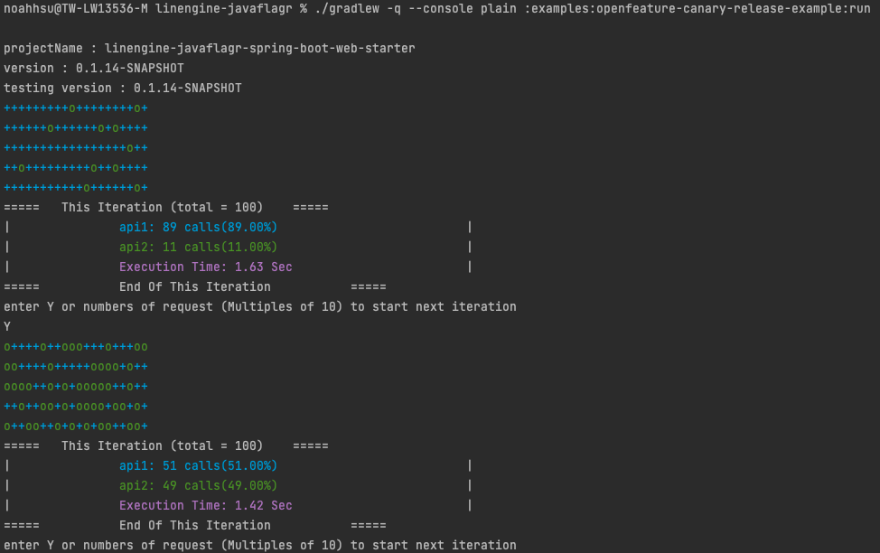

# Canary Release

This module shows how to perform a canary release by using toggle system through `flagship4j` 

## Get Started

### Prerequisite
- A JDK installed (JAVA 8+)
  <br>check with the following command, and you should see the JVM version
  ```shell
  # cd to project root
   ./gradlew -v
  ```

### prepare dependency
```shell
# cd to project root
docker compose up
```

### setup toggle configuration
1. open [http://localhost:18000/](http://localhost:18000/) in browser.
2. enter `canary-flag` in the add-flag field. 
  
3. click the "Create New Flag" button.
  
4. click the "canary-flag" row in the list and modify key and press "Save Flag" button.
  <br> - Flag Key: unique key representation of the flag (toggle)
  
5. create one "Variant" key = `on`.
  <br> - Variant: the possible result of the evaluation API
  
6. create a "Segment" with 25% Rollout (or the init rollout percentage you want) and any `name` (`name` won't affect evaluation result).
  <br> - Segment: the smallest unit for setting the result of a toggle
  
7. edit the "Distribution" to whatever you like (just make sure the sum is 100).
  <br> - Distribution: the distribution percentage setting of variants in a segment.
  
8. back to the top and enable the toggle
  
9. you can now run the demo app and set a high rollout percentage for the later iteration (remember to click "Save Segment Setting" button) 
  


### Run the demo App
- execute the following command
```shell
# cd to project root
./gradlew -q --console plain :examples:openfeature-canary-release-example:run
```

- demo execution screenshot
  
