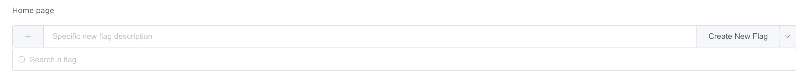
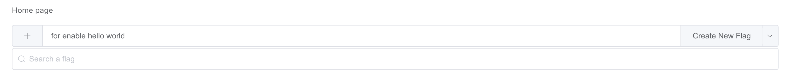
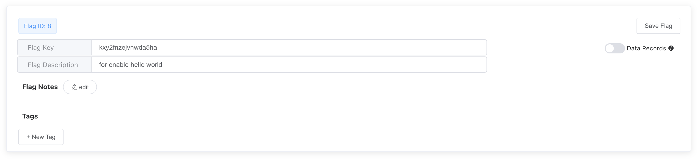
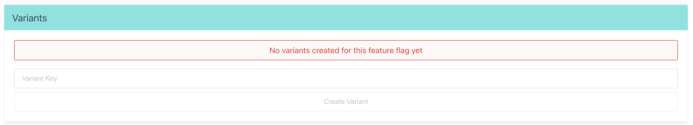
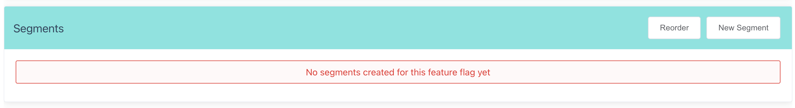
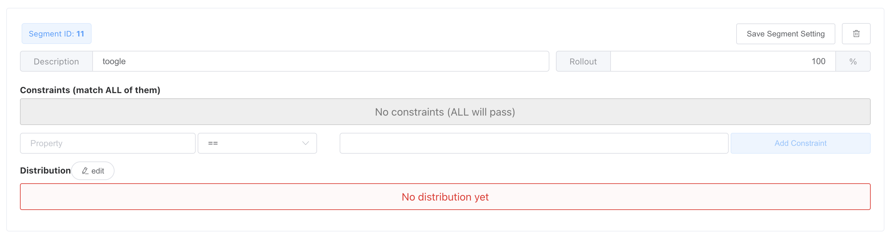
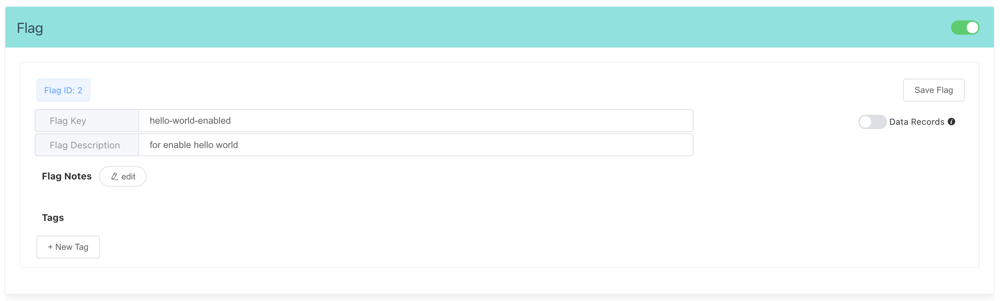
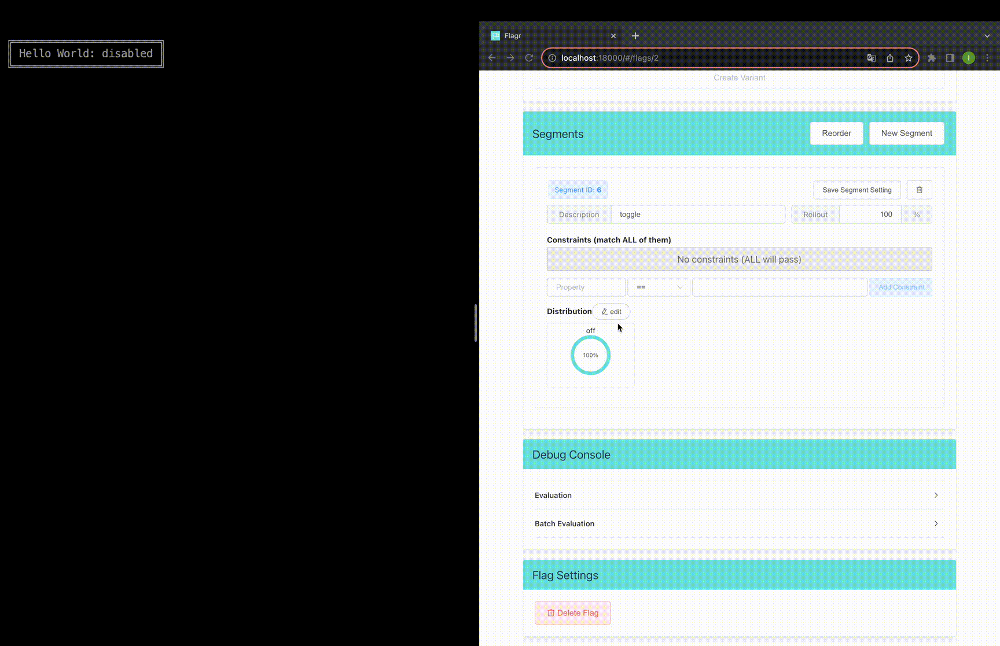

# On / Off

## Getting Started

### Hosting OpenFlagr Server via Docker Compose

```shell
# cd to project root
docker compose up
```

### Setting feature toggle

1. Opening OpenFlagr admin dashboard [http://localhost:18000/](http://localhost:18000/) in browser.

2. Entering any flag description in field which contains hint `Specific new flag description`.
   

3. Clicking the button `Create New Flag`.
   

4. Modifying the flag key to `hello-world-enabled` which is used as identifier in program.
   

5. Clicking the button `Save Flag` to ensure the key has been modified.
   

6. Creating two `Variant`s with keys `on` and `off`.
   > Variant: the possible result for the feature toggle.



7. Clicking button `New Segment` and creating a `Segment` with `100%` `Rollout`.
   > Segment: a specific subset of your user base or audience.
   > Rollout: gradually exposing a new feature to a broader audience over time.




8. Clicking button `edit` to edit `Distribution`, click checkbox to enable distribution for variant key `on` and set distribution rate to `100%`.
   > Distribution: the distribution rate for specific variants.




9. Enable the feature toggle
   

### Running the demo App

```shell
# cd to project root
./gradlew -q --console plain :examples:openfeature-example:run
```


