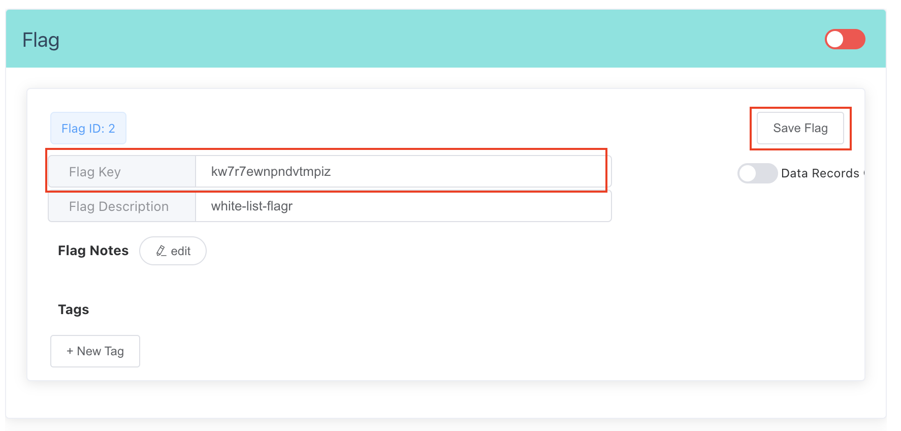
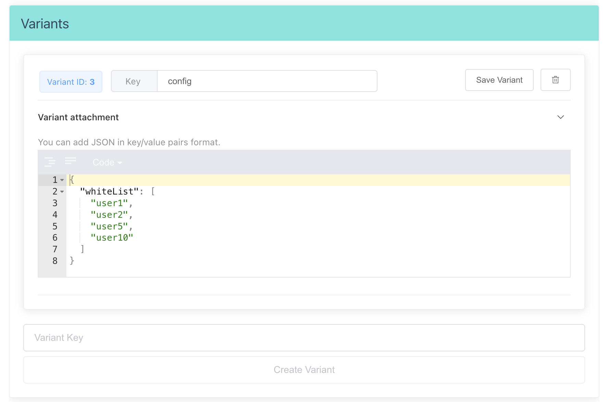
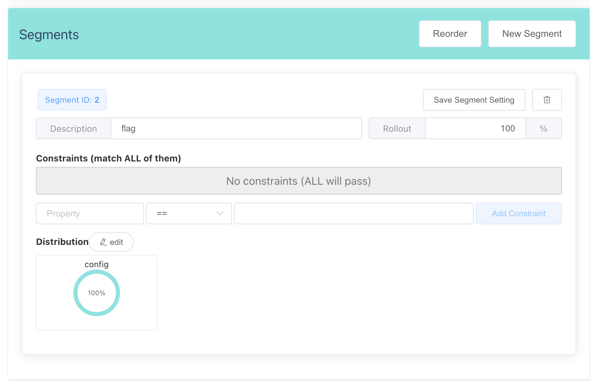
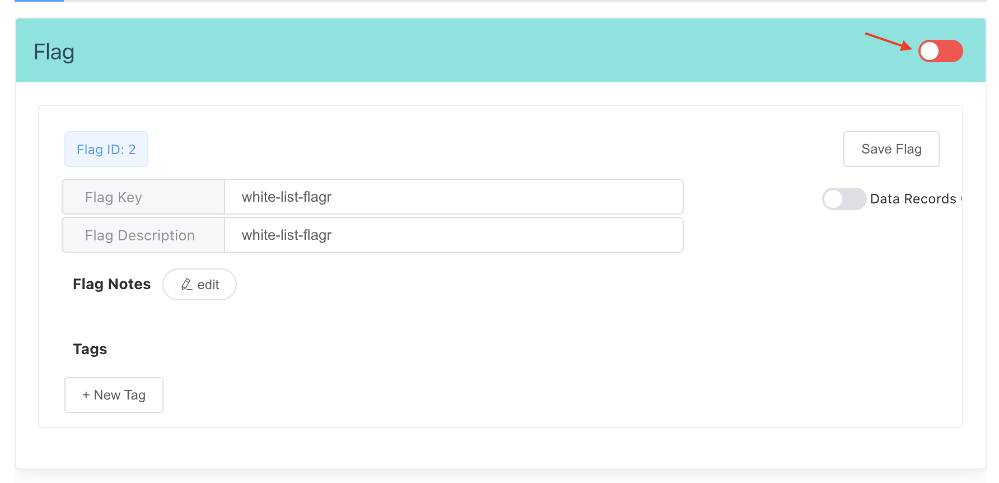
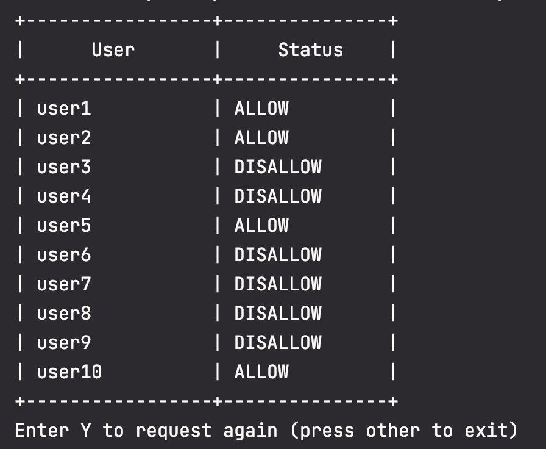

# White List Testing Example 

This is an White List example for line /flagship4j.
<br> this example utilize `variant attachment` to achieve it 

## Step toggle
### Add flag key for feature A and turn on it.
1. Open http://localhost:18000/ in browser.
2. Create `white-list-flagr` in the add-flag field.
3. Modify the flag key


### Create a variant
4. Create variant key = `config`
5. Then we could set variant attachment and config `whiteList` array for white list
<br> - you can configure `config` and `whiteList` to any name you like 


### Distribute variant
6. Distribute `config` and make sure rollout t0 `100%` for going to launch.


### Enable toggle
7. Back to the top and enable the toggle


### Run the example and check the outputs.

```shell
# cd to project root
./gradlew -q --console plain :examples:openfeature-white-list-example:run
```



